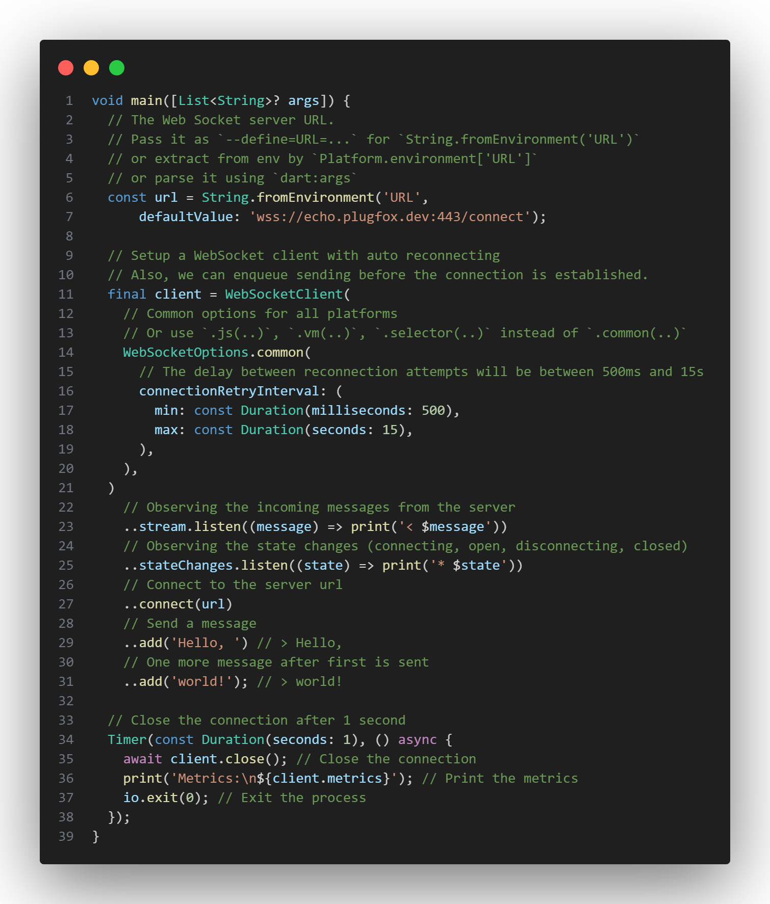

# WS: Cross-platform WebSocket client

[](https://pub.dev/packages/ws)
[](https://github.com/PlugFox/ws/actions)
[](https://codecov.io/gh/PlugFox/ws)
[](https://opensource.org/licenses/MIT)
[](https://pub.dev/packages/linter)
[](https://github.com/plugfox/ws/)

The `ws` package provides a cross-platform WebSocket client for both Dart and Flutter applications. It allows you to connect to a WebSocket server, send and receive messages, and handle the connection state changes.

---

## Installation

Add the following dependency to your `pubspec.yaml` file:

```yaml
dependencies:
  ws: <version>
```

## Properties

- `reconnectTimeout`: A read-only property that returns the reconnect timeout. The default value is 5 seconds.
- `state`: A read-only property that returns the current WebSocket connection state.
- `stateChanges`: A read-only property that returns a stream of WebSocket connection state changes.
- `stream`: A read-only property that returns a stream of message events handled by the WebSocket.
- `metrics`: A read-only property that returns a `WebSocketMetrics` object with metrics about the WebSocket connection.

## Methods

- `connect(String url)`: Connects to the WebSocket server specified by the URL argument.
- `disconnect([int? code = 1000, String? reason = 'NORMAL_CLOSURE'])`: Closes the WebSocket connection. You can optionally pass a numeric code and a reason string to the method to send close information to the remote peer.
- `add(Object data)`: Sends data on the WebSocket connection. The data can be either a String or a List of integers holding bytes.
- `close([int? code = 1000, String? reason = 'NORMAL_CLOSURE'])`: Permanently stops the WebSocket connection and frees all resources. After calling this method, the WebSocket client is no longer usable.

## Example


[Example of using the ws library](https://pub.dev/packages/ws/example) to connect to a WebSocket server

## Reconnection

The `ws` package provides a cross-platform WebSocket client that supports automatic reconnection in case of connection loss. The client automatically tries to reconnect to the server when the connection is lost. To handle reconnection-related events, you can register listeners for the `stateChanges` stream, which notifies you about changes in the connection state. When the connection is closed, the client tries to reconnect with a delay, which increases exponentially with each unsuccessful attempt to prevent overloading the server.

## Metrics

The `ws` package provides a cross-platform WebSocket client that supports metrics. The client automatically collects metrics about the number of sent and received messages, as well as the number of sent and received bytes. To get the metrics, you can use the `metrics` property, which returns a `WebSocketMetrics` object. The metrics are updated on demand, so you can get the latest values at any time.

## JSON

The `ws` package provides a cross-platform WebSocket client that supports JSON. The client automatically decodes incoming messages from JSON to Dart objects. To get the decoded messages, you can use the `client.stream.json` property, which returns a `Stream<Map<String, Object?>>` of decoded messages.

## Features and Roadmap

- ✅ Cross-platform WebSocket client for Dart and Flutter
- ✅ Support for secure WebSocket connections `wss://`
- ✅ Specifying custom protocols
- ✅ Connection state changes
- ✅ Reconnection to new URL
- ✅ Concurrency
- ✅ Backoff [full jitter strategy](https://aws.amazon.com/blogs/architecture/exponential-backoff-and-jitter/) for reconnection attempts
- ✅ Handy stream of messages with automatic JSON decoding
- ✅ Metrics & TX/RX bytes and counters
- ✅ Platform-specific options
- ✅ Connection timeout
- ✅ Creating Web Socket client from custom implementation
- ✅ Fake client for testing
- ✅ Custom exceptions
- ✅ 90% test coverage
- ✅ First message after connection/reconnection
- ✅ Interceptors (middlewares)
- ❌ Reusing client between isolates
- ❌ Automatic ping/pong for keep-alive & connection health check
- ❌ RPC support

## More resources

- [RFC 6455: The WebSocket Protocol](https://tools.ietf.org/html/rfc6455)
- [WebSocket API on MDN](https://developer.mozilla.org/en-US/docs/Web/API/WebSockets_API)
- [Dart HTML WebSocket library](https://api.dart.dev/stable/dart-html/WebSocket-class.html)
- [Dart IO WebSocket library](https://api.dart.dev/stable/dart-io/WebSocket-class.html)

## Coverage

[](https://codecov.io/gh/PlugFox/ws/branch/master)

## Changelog

Refer to the [Changelog](https://github.com/PlugFox/ws/blob/master/CHANGELOG.md) to get all release notes.

## Maintainers

[Matiunin Mikhail aka Plague Fox](https://plugfox.dev)

## Funding

If you want to support the development of our library, there are several ways you can do it:

- [Buy me a coffee](https://www.buymeacoffee.com/plugfox)
- [Support on Patreon](https://www.patreon.com/plugfox)
- [Subscribe through Boosty](https://boosty.to/plugfox)

We appreciate any form of support, whether it's a financial donation or just a star on GitHub. It helps us to continue developing and improving our library. Thank you for your support!

## License

[MIT](https://opensource.org/licenses/MIT)

## Tags

web, socket, ws, wss, WebSocket, cross, platform
